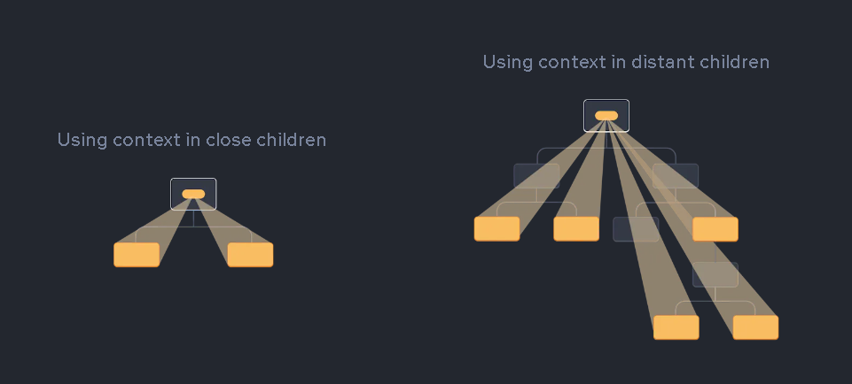

# Day 11 of React

# High Order Components

It is function which takes are components which enhances it and returns a component.

If a function doesn't do any of those things then it is called `first-order function`.

In `RestaurantCard.js`, we create a high order component which takes RestaurantCard as input and enhances with more info and returns it.

Here we take `RestaurantCard` as a input for `withPromotedLabel` component. The props are given from withPromotedLabel to its child RestaurantCard component, in case there are any

```js
export const withPromotedLabel = (RestaurantCard) => {
  return (props) => {
    return (
      <div>
        <label className="absolute bg-black text-white m-2 p-2 rounded-lg">
          {props?.resData?.info?.aggregatedDiscountInfoV3?.header +
            " " +
            props?.resData?.info?.aggregatedDiscountInfoV3?.subHeader}
        </label>
        <RestaurantCard {...props} />
        {console.log(props?.resData?.info)}
      </div>
    );
  };
};
```

In `Body.js`, we declare the withPromotedLabel Component.

```js
const RestaurantCardPromoted = withPromotedLabel(RestaurantCard);
```

In return statement, we logically render the component based on the discount information.

```js
<div className="flex flex-wrap">
  {filteredRestaurants.map((restaurant) => (
    <Link to={"/restaurants/" + restaurant.info.id} key={restaurant.info.id}>
      {restaurant?.info?.aggregatedDiscountInfoV3 !== undefined ? (
        <RestaurantCardPromoted resData={restaurant} />
      ) : (
        <RestaurantCard resData={restaurant} />
      )}
    </Link>
  ))}
</div>
```

## Accordion

The Accordion component lets users show and hide sections of related content on a page.

You can add custom styles to tailwind by adding them to tailwind config file

```js
module.exports = {
  content: ["./src/**/*.{html,js,ts,jsx,tsx}"],
  theme: {
    extend: {
      aspectRatio: {
        "4/3": "4 / 3",
        "1.5/1": "1.5 / 1",
      },
    },
  },
  plugins: [],
};
```

To enable toggle feature

```js
const [showItems, setShowItems] = useState(false);
const handleClick = () => {
  console.log("clicked");
  setShowItems(!showItems);
};
```

If a accordian is open, and we opened another accordian, previous one will still be showing items.
It should be done from `RestaurantMenu.js`, it should control `RestaurantCategory.js`

This `RestaurantMenu.js` is a `Controlled Component`

**NOTE** It is common to call a component with some local state “uncontrolled”. For example, the original Panel component with an isActive state variable is uncontrolled because its parent cannot influence whether the panel is active or not.

In contrast, you might say a component is “controlled” when the important information in it is driven by props rather than its own local state. This lets the parent component fully specify its behavior. The final Panel component with the isActive prop is controlled by the Accordion component.

Uncontrolled components are easier to use within their parents because they require less configuration. But they’re less flexible when you want to coordinate them together. Controlled components are maximally flexible, but they require the parent components to fully configure them with props.

In practice, “controlled” and “uncontrolled” aren’t strict technical terms—each component usually has some mix of both local state and props. However, this is a useful way to talk about how components are designed and what capabilities they offer.

When writing a component, consider which information in it should be controlled (via props), and which information should be uncontrolled (via state). But you can always change your mind and refactor later.

If you want to change your parent state variable from child, it's not possible directly. But you can send the setVar method of state variable as a prop. The above approach isn't that good way to send props to child.

# Prop Drilling

Prop drilling occurs when a parent component passes data down to its children and then those children pass the same data down to their own children. This process can continue indefinitely. At the end, it's a long chain of component dependencies that can be difficult to manage and maintain.


`RestaurantMenu.js` dummy variable is sent as a prop to RestaurantCategroy component.

```js
const RestaurantMenu = () => {
  const dummy = "dummy data";
  //,....code
  return (
    <div className="">
      {categories.map((c, index) => (
        <RestaurantCategory
          key={c?.card?.card?.title}
          data={c?.card?.card}
          showItems={index === showIndex ? true : false}
          setShowIndex={() => setShowIndex(index)}
          dummy={dummy}
        />
      ))}
    </div>
  );
};
```

`RestaurantCategory.js` sends dummy as a prop to ItemList

```js
const RestaurantCategory = ({ data, showItems, setShowIndex, dummy }) => {
  //.....code
  return (
    <div>
      <div className="w-1/2 m-auto bg-gray-50 shadow-lg p-4 my-4">
        <div
          className="flex justify-between cursor-pointer"
          onClick={handleClick}
        >
          <span className="font-bold text-lg">
            {data?.title} ({data?.itemCards.length})
          </span>
          <span>⬇</span>
        </div>
        {showItems && <ItemList dummy={dummy} items={data?.itemCards} />}
      </div>
    </div>
  );
};
```

It is very difficult to maintain the track of these props when there are more than 10 levels deep.

# Context API

React provides a solution to this called `Context API` which eliminates prop drilling.

The React Context API is a way for a React app to effectively produce global variables that can be passed around. This is the alternative to "prop drilling" or moving props from grandparent to child to parent, and so on.



`createContext(defaultValue)` lets you create a context that components can provide or read.

- defaultValue: The value that you want the context to have when there is no matching context provider in the tree above the component that reads context. If you don’t have any meaningful default value, specify null. The default value is meant as a “last resort” fallback. It is static and never changes over time.
- createContext returns a context object.

`createContext` returns a context object. Components can read context by passing it to `useContext()`

Creating a context

```js
import { createContext } from "react";
const UserContext = createContext({
  loggedInUser: "Default User",
});
```

Using a context

```js
//Header.js
const { loggedInUser } = useContext(UserContext);
```

Using Context in class based components

```js
<UserContext.Consumer>{(data) => console.log(data)}</UserContext.Consumer>
```

Example to provide context. We are providing context in root level `App.js`. So Every component can access the `loggedInUser` value.

Basically, here we are changing the value of context.

```js
const AppLayout = () => {
  const [userName, setUserName] = useState();
  useEffect(() => {
    const data = {
      name: "Tanuj Veera",
    };
    setUserName(data.name);
  }, []);

  return (
    <UserContext.Provider value={{ loggedInUser: userName }}>
      <div className="app">
        <UserContext.Provider value={{ loggedInUser: "Elon Musk" }}>
          <Header />
        </UserContext.Provider>
        <Outlet />
      </div>
    </UserContext.Provider>
  );
};
```

Here in the above code, Headers loads the `loggedInUser` as `Elon Musk` and In other components `loggedInUser` as `Tanuj Veera`

**Summary:**

**createContext:**

- createContext is a function used to create a new context object.
- It accepts an optional default value as an argument, which is used when a component consumes the context outside of a Context.Provider tree.
- Typically, you create a context at the top level of your application or component hierarchy.

**Use Case:** Use createContext when you want to define a new context object to share data across multiple components.

**useContext:**

- useContext is a hook that allows functional components to consume context easily.
- It accepts a context object created by createContext and returns the current context value.
- useContext must be used inside a functional component.

**Use Case:** Use useContext when you want to consume the context value within a functional component. It's a convenient way to access the context value without needing to use a Context.Consumer component.

**Context.Provider:**

- Context.Provider is a component used to provide the context data to its descendant components.
- It accepts a value prop which is the data that will be made available to the components consuming the context.
- Typically, Context.Provider is placed higher up in the component tree to wrap the subtree where the context data needs to be available.

**Use Case:** Use Context.Provider when you need to provide context data to descendant components. It's ideal for situations where multiple components within a subtree need access to the same context data.

**Context.Consumer:**

- Context.Consumer is a component used to consume the context data within a functional component.
- It's a render prop component, meaning it accepts a function as its child, and that function receives the current context value as its argument.
- Context.Consumer must be used inside the render function of a functional component.

**Use Case:** Use Context.Consumer when you need to access context data within a functional component. It's useful for consuming context data in components that are not directly wrapped by a Context.Provider component, allowing you to avoid prop drilling.
