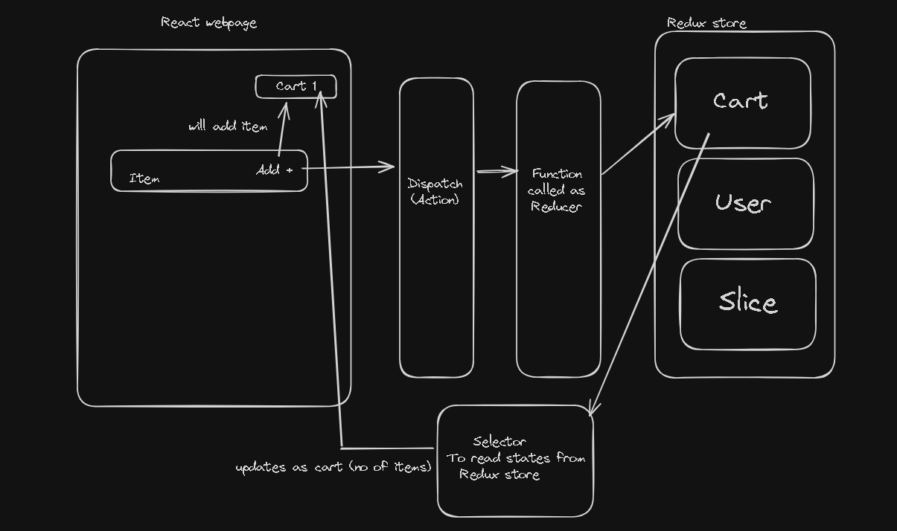

# Day 12 of React

# Redux Toolkit

There are something called `Slice` in Redux. Each state which should be maintained across the application.

There is a scenario in our app, where we need to add food items (RestaurantMenu) to cart component. 

When we click add on a food item, it `dispatches` an `action`. 

Then it calls a function which modifies the cart component or updates the slice of `Redux store`.

This `function` is called as `Reducer`.



To read data from the cart which is updated, in this scenario we use `selector` to read the data from store and update the React Component in Home page Cart with no of items added.

This process is called `subscribed` to the Redux store. So we can subscribe to redux store using selector.

## Next Steps 
- Install dependencies

  ```sh
  npm i @reduxjs/toolkit
  npm i react-redux
  ````

- Build store
- Connect our store to our app
- Create cart slice
- Dispatch an action
- selector

## Redux Store
The global state of an application is stored in an object tree within a single store

The Redux store is the main, central bucket which stores all the states of an application. It should be considered and maintained as a single source of truth for the state of the application.

## Actions in Redux
The only way to change the state is to emit an action, which is an object describing what happened.

State in Redux is read-only. This helps you restrict any part of the view or any network calls to write/update the state directly.

Instead, if anyone wants to change the state of the application, then they'll need to express their intention of doing so by emitting or dispatching an action.

## Reducers in Redux
To specify how the state tree is transformed by actions, we write pure reducers

Reducers, as the name suggests, take in two things: previous state and an action. Then they reduce it (read it return) to one entity: the new updated instance of state.

So reducers are basically pure JS functions which take in the previous state and an action and return the newly updated state.


## Build

We installed 2 dependencies. 
- `@reduxjs/toolkit` has all the required dependencies used to create redux stores or slices etc.
- `react-redux` is like a bridge between React and Redux which connects both.

`configureStore({})` Redux code to configure it. 
```js
//appStore.js
import {configureStore} from "@reduxjs/toolkit";
const appStore = configureStore({});
```

`<Provider key={configureStore}>` will provide the redux store to react 
```js
//App.js
return (
  <Provider key={appStore}>
    <UserContext.Provider value={{ loggedInUser: userName, setUserName }}>
      <div className="app">
        <UserContext.Provider value={{ loggedInUser: "Elon Musk" }}>
          <Header />
        </UserContext.Provider>
        <Outlet />
      </div>
    </UserContext.Provider>
  </Provider>
);
```

Create a card slice

```js
//cartSlice.js
import { createSlice } from "@reduxjs/toolkit";

const cartSlice = createSlice({
  name:'cart',
  initialState:{
    items:[]
  },
  reducers:{
    addItem:(state, action)=>{
      //mutating - modifying the state
      state.items.push(action.payload);
    },
    removeItem:(state)=>{
      state.items.pop();
    },
    clearCart:(state)=>{
      state.items.length=0;
    }
  }
})

export const {addItem, removeItem, clearCart} = cartSlice.actions;

export default cartSlice.reducer;
```

>Key points in above code
- createSlice will create slice which takes a few objects
  - `name` - name of the Redux slice
  - `initialState` (object) - define the initial state of a variable, in this case, `items`
  - `reducers` (object) - reducer function which will be called when an action is done.
    - every function takes 2 arguments 
      - `state` - provides the current state
      - `action` - provides the action
      - we are directly modifying our state.
- This is standard way to export reducers and actions.

Every `reducer` in `configureStore` is a combination of `reducers` of slices.

```js
const appStore = configureStore({
  reducer:{
    cart : cartReducer,
  }
});
```
## Selector

We use selector to get the state or gives access to store. Selector is Hook in React.

`useSelector()` is used to subscribe to the redux store. Here we are subscribing to `items` state in slice or store.
```js
//Header.js
const cartItems = useSelector((store)=> store.cart.items);
```

`useDispatch()` will dispatch the reducer function. Here `addItem()` reducer is called and the state is modified in `cartSlice` redux store

```js
  const dispatch = useDispatch();
  
  const handleAddItem = () =>{
  //dispatch an action
  dispatch(addItem("pizza"))
}
```

---

**Summary**
```
<Provider> will provide redux store to all the components wrapped in that tag.
useSelector() hook to get states
useDispatch() hook will dispatch the reducer function
cartSlice (Redux store/slice)
appStore (single source of truth for states)
```

---

>Older Redux or Vanilla Redux always prohibited mutating state or modifying state.

Here we have to copy those state to another variable and make changes to it and return it. Returning was mandatory.

```js
const cartSlice = createSlice({
  name:'cart',
  initialState:{
    items:[]
  },
  reducers:{
    addItem:(state,action)=>{
      const newState = [...state]
      newState.items.push(action.payload)
      return newState
    },
  }
});
```

But in New Redux Toolkit, Redux uses `Immer` library.

**Immer:** Immer can be used in any context in which immutable data structures need to be used. For example in combination with React state, React or Redux reducers, or configuration management.

How Immer works: Current State -> Draft State -> Next State.

It takes current state and draft a new state and return as next state.

We can't get the current state directly. If we want to get the current state in reducers, there is function called `current()` in `@reduxjs/toolkit`

```js
reducer:{
    addItem:(state,action)=>{
    console.log(current(state))
    state.items.push(action.payload)
  },
}
```

Redux Toolkit either mutate the existing state or reducer a new state.

Lets say we want to clear the cart and make the items array as 0

```js
//Either mutate the state
reducer:{
  clearCart:(state)=>{
      state.items.length = 0;
  },
}
// OR
// return the new state
reducer:{
  clearCart:(state)=>{
      return {items:[]};
  },
}
```

