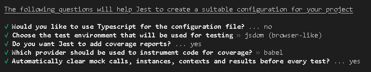

# Day 13 of React

# Testing

Types of testing that a developer can do.

- Unit Testing
- Integration Testing
- End to End Testing (E2E)

Unit testing and Integration testing are main testing types which we will deal with.

## React Testing Library

To test react, we have `React Testing Library`. There are testing libraries for other frameworks like Angular, Vue.

These libraries have a parent library called DOM testing library which is the base to all the specific framework testing libraries.

> Step 1
> Command to install the library

```sh
npm install -D @testing-library/react
```

## JEST

React Testing Library uses `Jest` library. So DOM & React testing library inherently uses `Jest` library.

> Step 2

```js
npm install --save-dev babel-jest @babel/core @babel/preset-env
```

Since we are babel, we have configure it in our app. Create a file in project root directory `babel.config.js`.

> Step 3 Install Jest

```sh
npm i -D jest
```

> Step 4 Configure Babel - [Link](https://jestjs.io/docs/getting-started "Babel Test")

```js
// babel.config.js
module.exports = {
  presets: [["@babel/preset-env", { targets: { node: "current" } }]],
};
```

Parcel uses Babel inherently. So there might be a conflict between them. We have to configure babel to work with parcel. [Parcel-Babel](https://parceljs.org/languages/javascript/#babel "Babel")

> Step 5 Configure Parcel file to disable default babel transpilation

create a file `.parcelrc`

```js
{
  "extends": "@parcel/config-default",
  "transformers": {
    "*.{js,mjs,jsx,cjs,ts,tsx}": [
      "@parcel/transformer-js",
      "@parcel/transformer-react-refresh-wrap"
    ]
  }
}
```

> Step 6 Jest Configuration which creates a `jest.config.js`

```sh
npx jest --init
```



## jsdom

`jsdom` is the test environment that will be used for testing. The test cases will not run on browsers.

It is a kind of browser. When a component is loaded, it loads in to jsdom.

**NOTE** If you're using Jest 28 or later, jest-environment-jsdom package now must be installed separately.

> Step 7

```js
npm install --save-dev jest-environment-jsdom
```

---

When you run test command

```sh
npm run test
```

It gives error saying, jest has checked for the folder with this regex pattern `**/__tests__/**/*.[jt]s?(x), **/?(*.)+(spec|test).[tj]s?(x)`

We have to keep all the test js files in `__test__` folder and file name is `**.test.js`/`**.test.ts` or `**spec.js`/`**.test.ts`

`__ __` (2 underscores as prefix and suffix) is known as `Dunder`.

---

**CODE** for Jest test cases

```js
import { sum } from "../components/sum";

test("Sum Function should calculate sum of numbers", () => {
  const result = sum(2, 3);
  //Assertion
  expect(result).toBe(5);
});
```

Test template

```js
test(<descrition>,callback function)
```

`expect()` - It expects result as input from the a component or function.

`toBe()` - It verifies whether the input is same as expected.

---

Whenever we are testing a component in React, we have to load the component in DOM.

React Testing Library has a method called `render(<Component/>)` which renders in to DOM.

```js
test("Should load contact as component", () => {
  render(<Contact />);

  const heading = screen.getByRole("heading");

  expect(heading).toBeInTheDocument();
});
```

We have rendered `<Contact/>` component using `render()`, this component is loaded in `jsdom`. We have to see if the heading has been rendered or not.

`getByRole()` method helps you to get the heading from the loaded DOM.

`expect()` method will expect heading and uses `toBeInTheDocument()`to check if it is present.

This above code throws error, because it doesn't support JSX in test cases

> Step 8: We have `@babel/preset-react` as dependency

```sh
npm install @babel/preset-react
```

You also have to add it to `babel.config.js` and give `runtime` as `automatic`

```js
module.exports = {
  presets: [
    ["@babel/preset-env", { targets: { node: "current" } }],
    ["@babel/preset-react", { runtime: "automatic" }],
  ],
};
```

> Step 9: It throws error, which says it didn't find the function `toBeInTheDocument()`.

```sh
npm install @testing-library/jest-dom
```

Lets say we want to test if the component has a input element. We can use `getByPlaceholderText()` to get that input element which has a placeholder.

```js
test("Should load input name inside contact component", () => {
  render(<Contact />);

  const heading = screen.getByPlaceholderText("Name");

  expect(heading).toBeInTheDocument();
});
```

---

**NOTE** If any case VSCode intellisense is not providing suggestions for the methods.

In your test files, Jest puts each of these methods and objects into the global environment. You don't have to require or import anything to use them. However, if you prefer explicit imports, you can do `import {describe, expect, test} from '@jest/globals'`.

Adding this above import statement explicitly has restored my VSCode intellisense.

---

`describe("<description>",()=>{<all the test cases can be enclosed here>})`

using `describe()`, we can replace `test()` with `it()` to write the test cases. Both are same.

```js
describe("Contact us page test cases", () => {
  test("Should load contact as component", () => {
    render(<Contact />);

    const heading = screen.getByRole("heading");

    expect(heading).toBeInTheDocument();
  });

  it("Should load input name inside contact component", () => {
    render(<Contact />);

    const heading = screen.getByPlaceholderText("Name");

    expect(heading).toBeInTheDocument();
  });
});
```

Since we are using redux for state management. When we try to run tests on any component, then it will throw error because jest doesn't understand redux.

Here, `<Header/>` doesn't pass the test because there are so many redux and react-dom elements which doesn't make sense to jest.

We have to provide the Redux store and Browser router to test it.

```js
it("Should load Header Component with a login button", () => {
  render(
    <BrowserRouter>
      <Provider store={appStore}>
        <Header />
      </Provider>
    </BrowserRouter>
  );
});
```

Different ways to test a component using screen

```js
it("Should render Header Component with a login button", () => {
  render(
    <BrowserRouter>
      <Provider store={appStore}>
        <Header />
      </Provider>
    </BrowserRouter>
  );

  // const loginButton = screen.getByRole("button");
  const loginButton = screen.getByRole("button", { name: "Login" });
  // const loginButton = screen.getByText("Login");
  expect(loginButton).toBeInTheDocument();
});
```

If you want to click a button and test the changes in the button rendered.

`fireEvent` will perform events in jsdom and then we can check for the newly rendered element.

```js
it("Should change login button to logout when clicked", () => {
  render(
    <BrowserRouter>
      <Provider store={appStore}>
        <Header />
      </Provider>
    </BrowserRouter>
  );

  const loginButton = screen.getByRole("button",{name:"Login"});
  //FireEvent
  fireEvent.click(loginButton);
  const logoutButton = screen.getByRole("button",{name:"Logout"});
  expect(logoutButton).toBeInTheDocument();
});
```

Testing a High Order Component (HOC)

```js
it("should render RestaurantCard component with Promoted label", () => {
  const RestaurantLabel = withPromotedLabel(RestaurantCard);
  render( <RestaurantLabel resData={MOCK_DATA}/>);

  const name = screen.getByText("ITEMS AT ₹179")

  expect(name).toBeInTheDocument();
});
````

