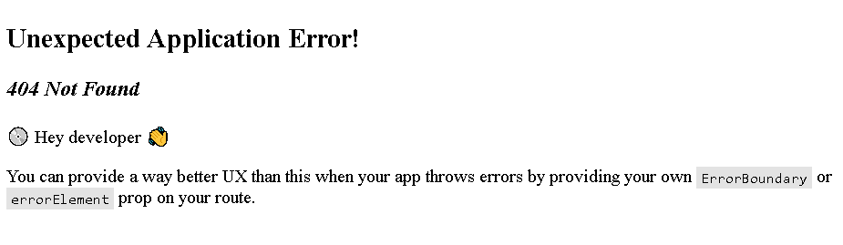

# Day 7 of React

# Routing in React

## useEffect Hook

useEffect Hook is called every time a component is rendered. Usually it is used for clean up process.

```js
const [stateVar, setStateVar] = useState([]);
useEffect(()=>{
  console.log("useEffect Rendered")
},[stateVar]);
```

useEffect(callback fn, dependency array)

Callback function is mandatory. If there are no dependency array, then it renders for every re-render the component undergoes. 

If there is a state variable in dependency array, then whenever the state of that variable changes then useEffect will be called. Dependency array can be any state variable (useState([])). 

>Even if there is a dependency array, at the initial render useEffect will run once. Then later whenever the state variable changes only then useEffect is called.

useEffect should always called at the top level of your component.

**NOTE** Never ever create useState Hook outside the component. Don't create useState Hooks in Conditional statements like `if else`.

## Routing

Using npm, install `react-router-dom`
```sh
npm install react-router-dom
```

So react-router-dom enables client side routing. Client side routing allows your app to update the URL from a link click without making another request for another document from the server. Instead, your app can immediately render some new UI and make data requests with fetch to update the page with new information.

This enables faster user experiences because the browser doesn't need to request an entirely new document or re-evaluate CSS and JavaScript assets for the next page. It also enables more dynamic user experiences with things like animation.

Add configuration in App.js

```js
import {createBrowserRouter} from "react-router-dom";

const appRouter = createBrowserRouter([
  {
    path:"/",
    element: <AppLayout/>,
  },{
    path:"/about",
    element:<About/>,
  },
]);
```

Here we declare the client side routing by specifying the path and also the component to be loaded when a specific route is requested by browser/user.

createBrowserRouter([]) is used to create and specify the routes.

```js
const root = ReactDOM.createRoot(document.getElementById("root"));
root.render(<RouterProvider router={appRouter}/>);
```

This RouterProvider will provide the component to render.

When we provide any route which isn't declared in createBrowserRouter(), then it throws a React error page



We can create our own custom error page.

or

react-router-dom provides an important Hook - `useRouterError`

```js
const Error = ()=>{
  const err = useRouteError();
  console.log(err);
  return(
    <div>
      <h1>Oops !!</h1>
      <h2>Something went wrong</h2>
      <h3>{err.status}: {err.statusText}</h3>
    </div>
  )
}
```

`err` variable will return an object which has all the error information like status code, message etc.

## Children Routes

Header isn't loaded when we are using routing. So to have the Header component intact with all other components. 

All the routes are populated in children attribute of createBrowserRouter()

```js
const appRouter = createBrowserRouter([
  {
    path: "/",
    element: <AppLayout />,
    errorElement: <Error />,
    children: [
      {
        path: "/",
        element: <Body />,
      },
      {
        path: "/about",
        element: <About />,
      },
      {
        path: "/contact",
        element: <Contact />,
      },
    ],
  },
]);
```
## Outlet

In AppLayout Component, we have to add a Component called `<Outlet>`

```js
const AppLayout = () => {
  return (
    <div className="app">
      <Header />
      <Outlet />
    </div>
  );
};
```


So Header will render and all the other children declared with paths in createBrowserRouter() will be rendered along with Header in AppLayout.

With respective the route path, the component is rendered. `<Outlet>` helps in rendering children routes.

## Link Component

Let's say there is a button About, you want to link that button to "/about" route. You can use `<a>` anchor tag. But we shouldn't use it. Because if you use anchor tag, when the button is clicked to navigate to another route, the whole page will re-render.

We have a component called `<Link/>` in react-router-dom, used to link routes. It doesn't re-render the whole page but only essential parts of page.