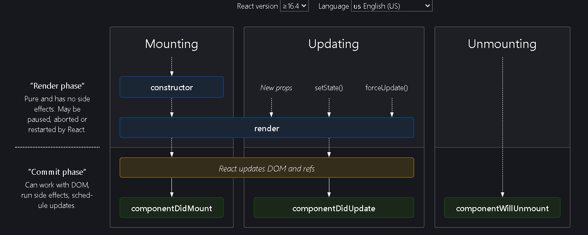

# Day 8 of React

# Class Based Components

Functional Components are new way of writing code in React. Class based components are old way of writing React code.

A class based component is Javascript Class which extends React Component class.

```js
class UserClass extends React.Component {
  render() {
    return;
  }
}
```

Class based components have `render()` method which returns JSX.

If we want to pass props to the Class components, we send the props to the constructor of the class.

`super(props)` is mandatory.

```js
class UserClass extends React.Component {
  constructor(props) {
    super(props);
    console.log(this.props);
  }
  render() {
    return (
      <div className="user-card">
        <h2>Name: {props.name}</h2>
        <h3>Location: Dehradun</h3>
        <h3>Contact: @tanujveera</h3>
      </div>
    );
  }
}
```

> As `UserClass` extends `React.Component` with the `super()` method. A component that extends `React.Component` must call the `super()` constructor in the derived class since it’s required to access this context inside the derived class constructor.

> It refers to the constructor of the parent class that is being extended in the current class. The purpose of using the super constructor with a props argument is to inherit the properties of the parent class and also pass in additional properties as arguments to the child class.

Loading a class based components means creating an instance of the class. When ever a class instance is created, the constructor is called. So, the constructor is the best place to receive props and create state variables.

In constructor, we define the state using the reserved keyword `state`

```js
constructor(props) {
  super(props);
  console.log(props);
  this.state={
    count:0,
    count2:1
  }
}
```

In `render()` method we can use this state variable using `this.state.count`

```js
render() {
  const {name, location,contact} = this.props;
  const{count,count2} = this.state;
  return (
    <div className="user-card">
      <h1>Count : {count}</h1>
      <h1>Count2 : {count2}</h1>
      <h2>Name: {name}</h2>
      <h3>Location: {location}</h3>
      <h3>Contact: {contact}</h3>
    </div>
  );
}
```

To update the state variable in class components, we have to use `setState({})` and we pass an JSON object which sets the state variable.

```js
<button
  onClick={() => {
    this.setState({
      count: this.state.count + 1,
      count2: this.state.count + 1,
    });
  }}
>
  Count Increase
</button>
```

We don't have to use `setState({})` method every time for each state variable. we can populate all those in a single `setState({})` method.

About component is parent component, UserClass component is child class based component. When parent component renders, it finds the child component and it loads it as well. Here in child component, a new `instance` is created and `constructor` is called, then `render()` is called.

Just like `render()` method, there are many lifecycle functions.

`componentDidMount()` will run when the component is completely mounted into the DOM.

```js
componentDidMount(){
 console.log("child Component did mount");
}
```

When a component is loaded, they are loaded in this order

Parent Constructor -> Parent Render -> Child Constructor -> Child Render -> Child componentDidMount() -> Parent componentDidMount()

Child is mounted first, then parent is mounted into DOM.

`componentDidMount()` is mostly used for API fetch calls. First the page renders, then API is fetched and rendered accordingly. When data is bring fetched, we can run a Shimmer UI or loading UI. When the data is fetched, then data is rendered.

To get an understanding of [React Life Cycle Components](https://projects.wojtekmaj.pl/react-lifecycle-methods-diagram/ "React Life Cycle")



Lets say 2 Child components are to be rendered in a Parent Component

```
Parent Constructor
Parent Render
  - First Child Constructor
  - First Child Render

  - Second Child Constructor
  - Second Child Render

  - First Child componentDidMount()
  - Second Child componentDidMount()

  - Parent componentDidMount()
```

There are 2 phases

1. Render Phase: Rendered phase is batched

- When `Mounting`, constructors and render() methods are called.
- When `Updating`, props, setState(), forceUpdate()

2. Commit Phase: Batched components are rendered and commit phase happens by updating DOM. This phase takes time.

- When `Mounting`, React updates DOM

While loading a component, DOM manipulation is expensive. So Commit phase takes time to update DOM. Instead of rendering each child component individually, it tries to update the DOM by getting the batched components renders to load into DOM.

Updating in Render Phase: When a state variable is set to new value, the component re-renders. Here `componentDidUpdate()` will be called when ever a state variable is set and update happens.

`componentWillUnmount()` will be called when ever the component will be removed from DOM. When switching between pages, it will unmount the current rendered component and render the new component. At that moment this lifecycle method will be called.

`componentWillUnmount()` allows you to perform any necessary cleanup, such as canceling timers, removing event listeners, or clearing any data structures that were set up during the mounting phase.

Why should we clean up?

```js
componentDidMount() {
    console.log("Component Did Mount");
    this.timer = setInterval(()=>{
      console.log("setInterval")
    },1000);
  }
```

This above code will start a timer printing `setInterval` every second. When you navigate to other component pages, it will continue to count timer in background. Now return to the previous page and you will notice 2 timers will be running. This is the problem with Single Page Applications.

We can clean up the code using life cycle method `componentWillUnmount()`

```js
componentWillUnmount() {
  console.log("User component unmounted");
  clearInterval(this.timer);
}
```

**NOTE** `this` keyword will used then that respective method, variable will be shared in the whole class.

So we should clean up our code.

Even if we use `useEffect()` in functional component which has setInterval(), even then it won't stop the timer even when you switch between pages.

Here, First `Rendered` is printed, then `About useEffect` is printed. And when you go another page, then the `About return` is printed. This is how we can do clean up in `useEffect()`

```js
const About = () => {
  useEffect(() => {
    console.log("About useEffect");
    return () => {
      console.log("About return");
    };
  }, []);
  console.log("Rendered");
};
```

---

Never Compare Class life cycle methods to Functional React Hooks.

In useEffect(), After every render, it is updated not mounted.

**NOTE** The term "mounting" in class components refers to the process of creating an instance of the component and inserting it into the DOM. componentDidMount is the lifecycle method called after the component has been mounted into the DOM. 

After functional components are introduced, React have removed life cycle methods.

In class based Components, if we need to update componentDidUpdate()' based on the previous state, previous props then we have to do it like this, which was very hard.

```js
componentDidUpdate(prevProps, prevState) {
  if (this.state.count != prevState.count) {
    console.log("Component Did Update");
  }
}
```
