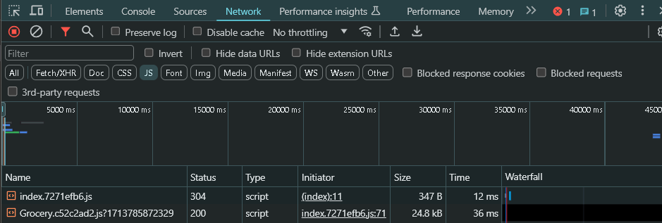

# Day 9 of React

# Optimize React App

Single Responsibility Principle: The idea behind the SRP is that every class, module, or function in a program should have one responsibility/purpose in a program.

`Every class or function should have only one reason to change.`

We wrote every component in different files.

Keeping your code modular keeps your code maintainable and testable.

## Custom Hooks

When you have component logic that needs to be used by multiple components, we can extract that logic to a custom Hook. It makes our code more readable and usable.

Custom Hooks start with `use`. Example: useFetch()

Fetching the data from an API and returning it, which can be used almost anywhere. So we can create a custom hook.

```js
const useRestaurantMenu = (resId) => {
  const [resInfo, setResInfo] = useState(null);

  const fetchData = async (resId) => {
    const data = await fetch(MENU_API + resId);

    const jsonData = await data.json();
    // console.log(jsonData);
    console.log(jsonData?.data);

    setResInfo(jsonData?.data);
  };

  useEffect(() => {
    fetchData(resId);
    console.log("use Effect Menu");
  }, []);

  return resInfo;
};
```

All Custom Hooks should have `use` as a prefix.

# User Online or Offline

How to write a custom hook?

Finalize the contract, meaning be clear on what that custom hook should perform. What are the inputs it needs and output it should give.

To create a feature if user is online or offline. We have to use `window` object which has `online event`

Syntax:
```js
addEventListener("online",(event)=>{});
ononline = (event)=>{};
```

We created a `useOnlineStatus()` Hook which displays a text whether user is offline or online. We used this hook in Header component to show user status.

## App Chunking

App Chunking is also known as code splitting, lazy loading, dynamic bundling, on-demand loading, dynamic import.

We can logically break our application into multiple bundles. So we don't put load on a single js file. When the bundled js file is loaded, it shouldn't so much time to load. So when you split your code into multiple bundled js files. it is easy to fetch and also app loads faster.

We created a Grocery.js component. To make it lazily load. Initially when app loads, it doesn't load Grocery page, when ever we click on grocery then it loads it.

React has a function called `lazy(callback Fn)`

```js
const Grocery = lazy(()=> import("./components/Grocery"))
```

Now since we used lazy loading for Grocery component, it doesn't load the grocery js file initially. When we click on Grocery, then it fetches the js file for Grocery component and then loads it. But it throws error.

Initial Render


When clicked on Grocery, it fetches the Grocery js file



It throws an error, saying that component suspended while responding to synchronous input.


We have to use `<Suspense>` which shows some fallback JSX until children have finished loading.

```js
{
  path: "/grocery",
  element: <Suspense fallback={<h2>Loading.....</h2>}><Grocery /></Suspense>,
},
```

After adding `<Suspense>` Component, it loads the JSX in fallback. fallback is an alternate UI to render in place of actual UI.

